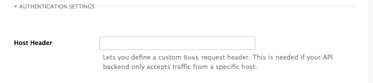
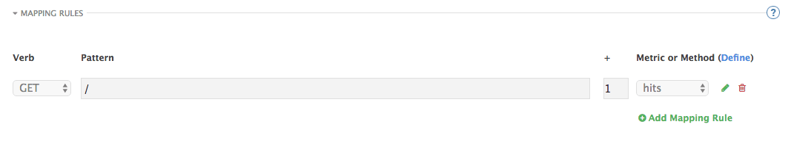
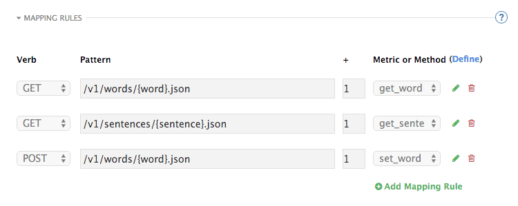

# APIcast Overview

APIcast is an NGINX based API gateway used to integrate your internal and external API services with 3scale’s API Management Platform.

Here you’ll learn more about deployment options, environments provided, and how to get started.

## Deployment options

You can use APIcast hosted or self-managed, in both cases, it needs connection to the rest of the 3scale API management platform:
- **<a href="hosted">APIcast hosted</a>**: 3scale hosts the gateway in the cloud. The API gateway is already deployed for you and it's limited to 50,000 calls per day.
- **APIcast self-managed**: You can deploy APIcast wherever you want. To do so, download the json configuration file from API > Integration > Production or fetch it using the Account management API. The self-managed mode is the intended mode of operation for production environments. Here are a few recommended options to deploy your API gateway:
  - <a href="self-managed">Direct deploy</a>: Where the customer needs to deploy a supported version of Nginx/ OpenResty and use the 'GA' tagged release from the [APIcast repository](https://github.com/3scale/apicast/releases).
  - <a href="openshift-guide">OpenShift</a>: Where the customer deploys on a supported version of OpenShift a released and unmodified OpenShift template for APIcast, which will run the official Docker images.
  - <a href="docker">Docker</a>: Where the customer runs a dockerized image downloaded from the Red Hat Docker Registry, using a supported version of Docker.

## Environments

By default, when you create a 3scale account, you get APIcast **hosted** in two different environments:

- **Staging**: It’s meant to be used only while configuring and testing your API integration. When you have confirmed that your setup is working as expected, then you can choose to deploy it to the production environment.
- **Production**: Limited 50,000 calls per day and supports the following out-of-the-box authentication options: App key, app key and app id pair.

## Getting API traffic in 1 minute

Follow the next steps to configure your API gateway in no time:

### 1. Declare your private base URL

The **private base URL** is the endpoint host of your API backend. For instance, if you were Twitter the Private Base URL would be ```https://api.twitter.com/```, or if you are the owner of the Sentiment API it would be ```http://api-sentiment.3scale.net/```.

The gateway will redirect all traffic to your API backend after all authentication, authorization, rate limits and statistics have been processed.

### Step 2: Update the hosted gateway

To update the **hosted gateway** you just have to **save** the settings (API backend, Advanced settings etc.) by clicking on the **Update & Test Staging Configuration** button in the lower right part of the page. This process will deploy your gateway configuration (at this stage the default configuration) to 3scale's hosted gateway.

### Step 3: Get a set of sample credentials

Go to the **Applications**, click on any application using the service you're configuring, and get the **API credentials**. If you do not have applications/ users yet, you can create an application yourself (from the details page of any individual developer account), the credentials will be generated automatically.

Typically the credentials will be a ```user_key``` or the pair ```app_id/app_key``` depending on the authentication mode you are using (note that the 3scale hosted gateway does not currently support OAuth, however you can configure it if you are using the self-managed gateway integration.

### Step 4: Get a working request

We are almost ready to roll. Go to your browser (or command-line curl) and do a request to your own API to check that everything is working on your end.

For instance it could be something like this:

```
http://api-sentiment.3scale.net/v1/word/good.json
```
Note that you are not using 3scale's gateway yet. You are just getting a working example that will be used in the next step.

### Step 5: Get a working request to your API

Now do the same request but replacing your **private base URL** (in the example ```http://api-sentiment.3scale.net:80```) by your hosted endpoint (e.g. if you were Twitter, you would need to change the ```https://api.twitter.com``` to ```https://api-xxxxxxxxxxxxx.staging.apicast.io```). You also have to add the parameters to pass the credentials that you just copied.

Continuing the example in this tutorial it would be something like:

```
https://api-2445581436380.staging.apicast.io:443/v1/word/good.json?user_key=YOUR_USER_KEY
```

If you execute this request you will get the same result as in Step 4. However, this time the request will go through the 3scale hosted gateway.

**And that's it! You have your API integrated with 3scale**.

3scale's hosted gateway does the validation of the credentials and applies any gateway rules that you have defined to handle rate-limits, quotas and analytics. If you did not touch the mapping rules every request to the gateway will increase the metric ```hits``` by 1, you can check in your admin console how the metric ```hits``` is increased.

If you want to experiment further, you can test what happens if you try credentials that do not exist. The gateway will respond with a generic error message (you can define your custom one).

You can also define a rate limit of 1 request per minute. After you try your second request within the same minute you will see that the request never reaches your API backend. The gateway stops the request because it violates the quota that you have just set up.

## Integration options

### Endpoints

* **What is your Private Base URL?** The Private Base URL is the endpoint of your API. It is where the gateway will forward the requests that it receives. The API backend can also be HTTPS, in this case you just use the appropriate protocol and port, e.g. ```https://api-sentiment.3scale.net:443```

* **What is the Public Base URL?** The Public Base URL is where your developers will send the requests to when using your API. This applies to the hosted mode only, on a self-managed gateway you can set a custom public endpoint. In the hosted version, the Public Base URL is set by 3scale and cannot be changed.

### Host Header

This option is only needed for those API backends that reject traffic unless the ```Host``` header matches the expected one. In these cases, having a gateway in front of your API backend will cause problems since the ```Host``` will be the one of the gateway, e.g. ```xxx-yyy.staging.apicast.io```

To avoid this issue you can define the host your API backend expects in the **Host Header** field, and the hosted gateway will rewrite the host.

<div class="screenshot">
  
</div>

### Deployment History

Every time you click on the **Update & Test Staging Configuration** button, the current configuration will be deployed to the 3scale hosted gateway and saved in a JSON file. From that point on, the API requests to the hosted gateway will be handled by the new configuration.

Note that it is not possible to automatically roll back to previous configurations. Instead we provide a history of all your deployments with the associated configuration files. These files can be used to check what configuration you had deployed at any moment on time. If you want to, you can recreate any deployments manually.


### Mapping rules

By default we start with a very simple mapping rule,

<div class="screenshot">
  
</div>

This rule says, that any ```GET``` request that starts with ```"/"``` will increment the metric ```hits``` by 1. Most likely you will remove this rule since it is too generic.

The mapping rules define which metrics (and methods) you want to report depending on the requests to your API. For instance, below you can see the rules for the Sentiment API that serves us as an example:

<div class="screenshot">
  
</div>

The matching of the rules is done by prefix and can be arbitrarily complex (the notation follows Swagger and ActiveDocs specification)

* You can do a match on the path over a literal string: ```/v1/word/hello.json```
* Mapping rules can contain named wildcards: ```/v1/word/{word}.json```

This rule will match anything in the placeholder ```{word}```, making requests like```/v1/word/awesome.json``` match the rule.

Wildcards can appear between slashes or between slash and dot.

* Mapping rules can also include parameters on the query string or in the body: ```/v1/word/{word}.json?value={value}```

Both POST and GET requests follow the same notation. The gateway will try to fetch the parameters from the query string when it's a GET and from the body when it's a POST, DELETE, PUT.

Parameters can also have named wildcards.

Note that all mapping rules are evaluated. There is no precedence (order does not matter). If we added a rule ```/v1``` to the example on the figure above, it would always be matched for the requests whose path starts with ```/v1``` regardless if it is ```/v1/word``` or ```/v1/sentence```. Keep in mind that if two different rules increment the same metric by one, and the two rules are matched, the metric will be incremented by two.

#### Mapping rules workflow

The intended workflow to define mapping rules is as follows:

* You can add new rules by clicking the **Add Mapping Rule** button. Then you select an HTTP method, a pattern, a metric (or method) and finally its increment. When you are done, click **Update & Test Staging Configuration** to apply the changes.
* Mapping rules will be grayed out on the next reload to prevent accidental modifications.
* To edit an existing mapping rule you must enable it first by clicking the pencil icon on the right.
* To delete a rule click on the trash icon.
* Modifications and deletions will be saved when you hit the **Update & Test Staging Configuration** button.

For more advanced configuration options, you can check the ['APIcast advanced configuration'](advanced-apicast-config) tutorial.
